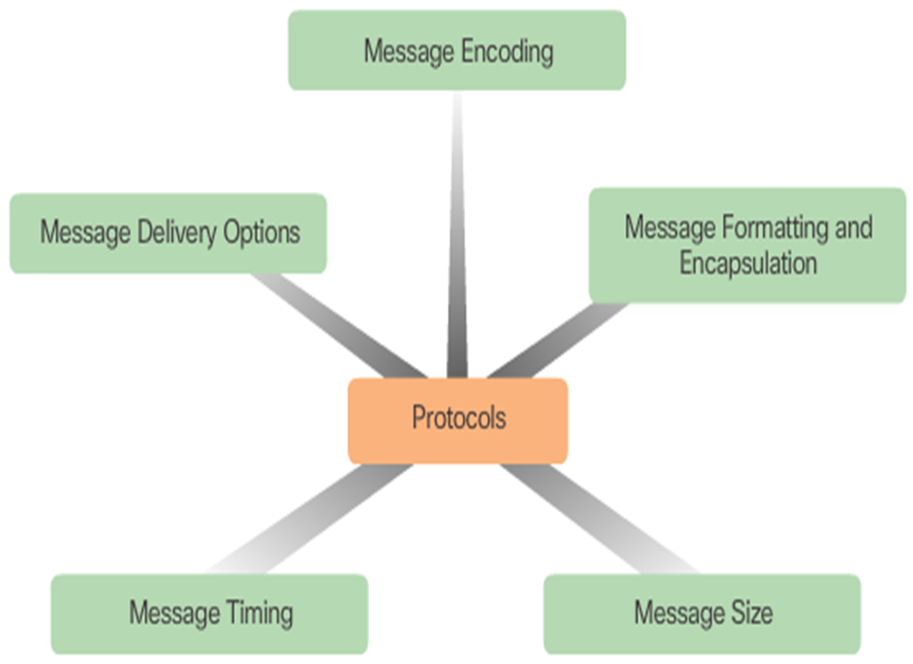

# 💻 Overview

***

**Computer network is made up of **_**nodes**_ **and** _**links**_

* _nodes_: can be computers, swithchers, routers etc.

internetwork (network) is the network of networks

**Network connects a lot of computers together, and the internet connevts a lot of networks together through routers. The computers connected with the network are usually called \_hosts.**\_

***

**ARPANET**: the first packet switched network

* TCP/IP protocol

internet: a general noun -> any protocols

Internet: a proper noun -> must use the TCP/IP protocol

***

## Conponents of the Internet

<table data-view="cards"><thead><tr><th></th><th></th><th></th></tr></thead><tbody><tr><td><strong>Devices</strong></td><td>

<ul><li>Hosts: end systems</li></ul><ul><li>Running network aps at Internet's "edge"</li></ul></td><td></td></tr><tr><td><strong>Packet Swithches</strong>: forward packets (chunks of data)</td><td>

<ul><li>Routers, swithes</li></ul></td><td></td></tr><tr><td>

<strong>Communication Links</strong>
<ul><li>Fiber, copper, radio, satellite</li><li>Ransmission rate: bandwidth</li></ul></td><td></td><td></td></tr><tr><td>

<strong>Networks</strong>
<ul><li>Collection of devices, routers, links: managed by an organization</li></ul></td><td></td><td></td></tr><tr><td>

<strong>Internet</strong>: network of networks
<ul><li>Interconnected ISPs (Internet Service Provider) &#x3C;- IXP (Internet eXchange Point): make two ISPs connect directly and switch packets</li></ul></td><td></td><td></td></tr><tr><td>

<strong>Protocols</strong>
<ul><li>Control sending, receiving of messages</li><li>e.g., HTTP (Web), streaming video, Skype, TCP, IP, WiFi, 4G, Ethernet</li></ul></td><td></td><td></td></tr><tr><td>

<strong>Internet Standaeds</strong>
<ul><li>RFC: Request for Comments</li><li>IETF: Internet Engineering Task Force</li></ul></td><td></td><td></td></tr></tbody></table>

***

## Tpyes of Networks

### **Main**

* WAN: Wide Area Network
* LAN: Local Area Network

### Others

* MAN: Metropolitan Area Network
* WLAN: Wireless LAN
* SAN: Storage Area Network
* PAN: Personal Area Network
* WPAN: Wireless PAN

***

## Generic Communication Model

<figure><figcaption>
Generic Communication Model
</figcaption></figure>

***

## Protocols

**Protocols define the format, order of messages sent and received among network entities, and actions taken on msg transmission, receipt**

all communication activity in Internet governed by protocols

<figure><figcaption>
A Human Protocol and a Computer Network Protocol
</figcaption></figure>

<figure><figcaption>
Rule Establishment
</figcaption></figure>

1. **Message Size**

* The source host breaks a long message into individual pieces or frames that meet both the minimum and maximum size requirements.\
  _Each frame will also have its own addressing information._
* At the receiving host, the pieces are reconstructed to be processed and interpreted.

2. **Message Timing**

#### _Rule of engagement_

* Access Method
* Flow Control
* Response Timeout

3. **Message Formatting and Encapsulation**

<figure><figcaption>
An Envelop Format for Humans
</figcaption></figure>

<figure><figcaption>
A Frame Format for Computers
</figcaption></figure>

A computer network follows specific format rules: computer messages are also encapsulated in a specific format, called a **frame**, before it is sent over the network.

A **frame** acts like an envelope; it provides the address of the destination and the address of the source host. Again, messages that are not correctly formatted are not successfully delivered to or processed by the destination host.

### Protocol Layers and Reference Models

#### Why layers?

Dealing with complex systems:

* Explicit structure allows identification, relationship of complex system’s pieces
* Modularization eases maintenance, updating of system

#### Protocol Models & Reference Model

**Protocol model** - This type of model closely matches the structure of a particular protocol suite. The TCP/IP model is a protocol model because it describes the functions that occur at each layer of protocols within the TCP/IP suite.

**Reference model** - This type of model provides consistency within all types of network protocols and services by describing what has to be done at a particular layer, but not prescribing how it should be accomplished. The OSI model is a widely known internetwork reference model, but is also a protocol model for the OSI protocol suite.

_In a word, protocol models closly band with the architecture of a particular protocol, explicitly discribing the function of each layer, but reference models just provide a universal architecture, without a specific accomplish approach._

#### OSI Reference Model

OSI/RM (OSI): Open System Interconnection Reference Model

Evey system follows OSI standard can communicate with the other systems locating anywhere over the world which also follow the standard.

<figure><figcaption>
The OSI Reference Model
</figcaption></figure>

#### TCP/IP Protocol Model

<figure><figcaption>
The TCP/IP Protocol Model
</figcaption></figure>

#### Internet Protocol Stack

<figure><figcaption>
Internet Protocol Stack
</figcaption></figure>

* **application**: supporting network applications: IMAP, SMTP, HTTP
* **transport**: process-process data transfer: TCP, UDP
* **network**: routing of datagrams from source to destination: IP, routing protocols
* **link**: data transfer between neighboring network elements: Ethernet, 802.11 (WiFi), PPP
* **physical**: bits “on the wire”

#### Difference Between the Three Models

OSI is the typically ligal international standard. TPI/IP is the de facto international standard.

The Internet Protocol Stack combines the advantages of both, making it a very convenient way to narrate the principles of computer networks.

<figure><figcaption>
OSI &#x26; TCP/IP
</figcaption></figure>

### Protocol Suits

**A group of inter-related protocols necessary to perform a communication function.**

Protocol suites are implemented by hosts and networking devices in software, hardware or both.

#### TCP/IP Protocol Suits

<figure><figcaption>
TCP/IP Protocol Suits
</figcaption></figure>

The TCP/IP protocol suite is an open standard, meaning these protocols are freely available to the public, and any vendor is able to implement these protocols on their hardware or in their software.

<figure><figcaption>
Protocol Suites and Industry Standards
</figcaption></figure>

### The Transfer of Data between Layers

<figure><figcaption>
The Transfer of Data between Layers
</figcaption></figure>

The data is transfered as a bit stream during the physical layer.

***

## Message Segmentation

<figure><figcaption>
Segmentation &#x26; Multiplexing
</figcaption></figure>

<figure><figcaption>
The strategy will add the complexity
</figcaption></figure>

* Allows many different conversations to be interleaved
* Increases the efficiency of network communications
* Adds complexity

***

## Protocol Data Units

<figure><figcaption>
The Encapsulation Process
</figcaption></figure>

As application data is passed down the protocol stack on its way to be transmitted across the network media, various protocol information is added at each level. This is known as the **encapsulation process**.

The form that a piece of data takes at any layer is called a **protocol data unit (PDU)**. During encapsulation, each succeeding layer encapsulates the PDU that it receives from the layer above in accordance with the protocol being used. At each stage of the process, a PDU has a different name to reflect its new functions.

_-Data (Message) -Segment -Packet -Frame -Bits_

***

Network Address & Data Link Address

<figure><figcaption>
Contenet in Each Layer
</figcaption></figure>

**Network layer source and destination addresses** - Responsible for delivering the IP packet from the original source to the final destination, either on the same network or to a remote network.

**Data link layer source and destination addresses** – Responsible for delivering the data link frame from one network interface card (NIC) to another NIC on the same network.

***

## Data Link & Networks Addresses

### Devices on the Same Network

<figure><figcaption>
Device on the Same Network
</figcaption></figure>

#### 1. Role of the Network Layer Addresses

The network layer addresses, or IP addresses, indicate the original source and final destination. An IP address contains two parts:

**Network portion** – The left-most part of the address that indicates which network the IP address is a member. All devices on the same network will have the same network portion of the address.

**Host portion** – The remaining part of the address that identifies a specific device on the network. The host portion is unique for each device on the network.

#### 2. Role of the Data Link Layer Addresses

When the sender and receiver of the IP packet are on the same network, the data link frame is sent directly to the receiving device. On an Ethernet network, the data link addresses are known as Ethernet **(Media Access Control)** addresses. **MAC** addresses are physically embedded on the Ethernet NIC.

### Devices on a Remote Network

<figure><figcaption>
Devices on a Remote Network
</figcaption></figure>

#### 1. Role of the Network Layer Addresses

The source and destination IP addresses will represent hosts on different networks indicated by the different network portions of the source and destination addresses.

#### 2. Role of the Data Link Layer Addresses

Destination MAC address - When the receiving device is on a different network from the sending device, the sending device uses the Ethernet MAC address of the default gateway or router.
